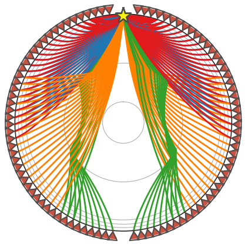

# Seismic Ray Tracing

This project explores numerical ray tracing in layered Earth models to simulate the propagation of seismic waves through subsurface structures.

## Overview

Seismic ray tracing is used in geophysics to model how seismic waves travel through materials with varying velocities. By computing ray paths through layered medium, we can better understand how waves bend and reflect as they encounter different geological structures.

This notebook implements a simple ray tracing model and visualizes the resulting ray paths through a stratified velocity structure.

## Objectives

* Model seismic wave propagation through layered medium
* Implement numerical ray tracing methods
* Visualize ray paths and travel behaviour
* Interpret how velocity contrasts affect wave trajectories
* Estimate epicentral distance and origin time for an earthquake

## Contents

* `seismic_ray_tracing.ipynb` – Jupyter notebook containing the ray tracing implementation, figures, and analysis.

All plots and figures are generated directly within the notebook.

## Methods

The notebook computes ray trajectories through a layered velocity model by applying Snell’s Law at each interface and numerically tracing the resulting paths.

Visualisations show how seismic rays refract as they encounter layers with different wave velocities.

## Notes

This work was completed as part of a university geophysics laboratory exercise.
Some notebook structure and instructional text were provided as part of the lab materials. The code implementation, execution, and analysis were completed as part of the assignment.

## Skills Demonstrated

* Python programming
* Numerical modelling
* Scientific data visualisation
* Geophysical wave propagation concepts
